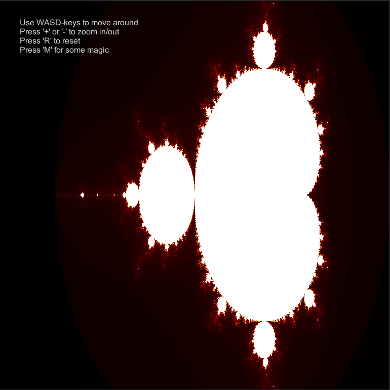
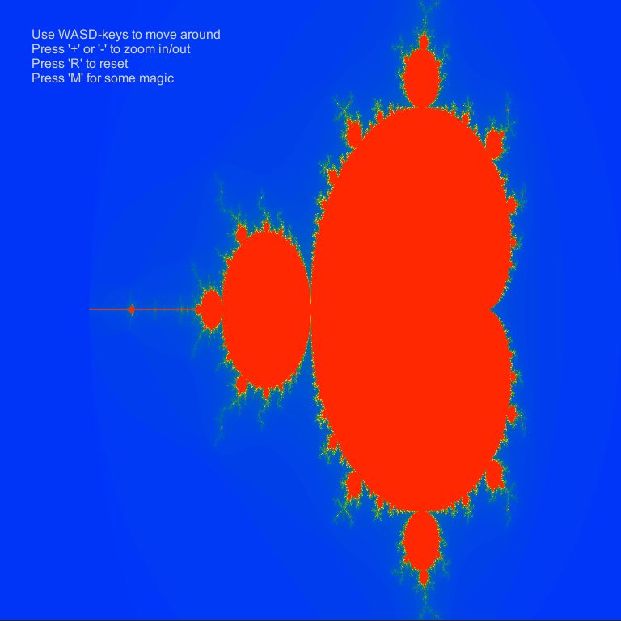
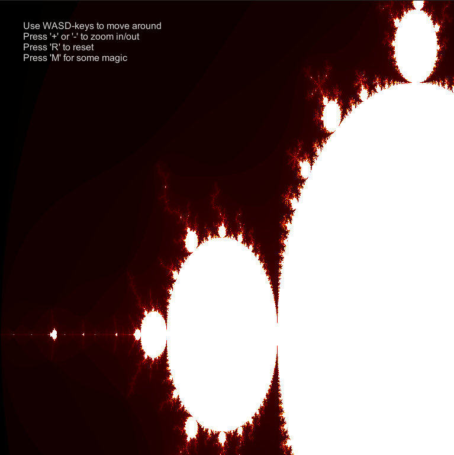
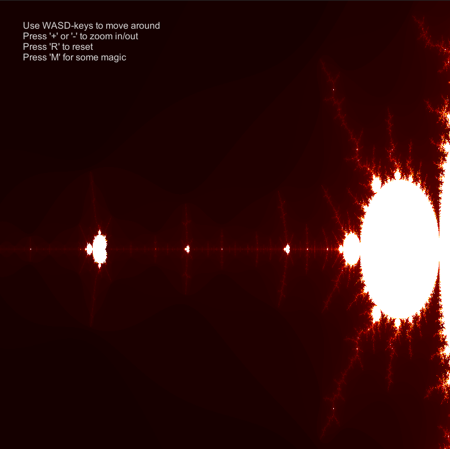
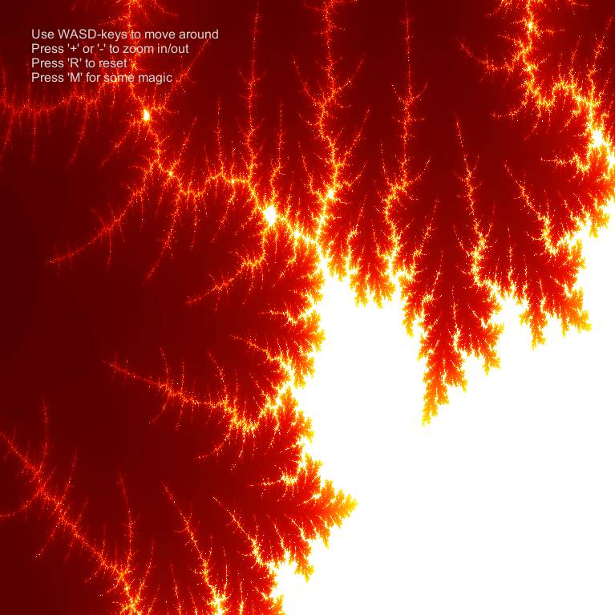
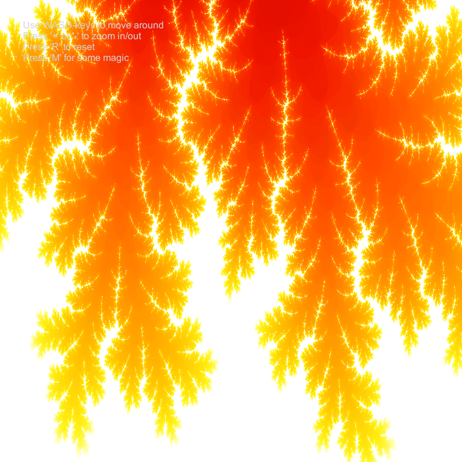
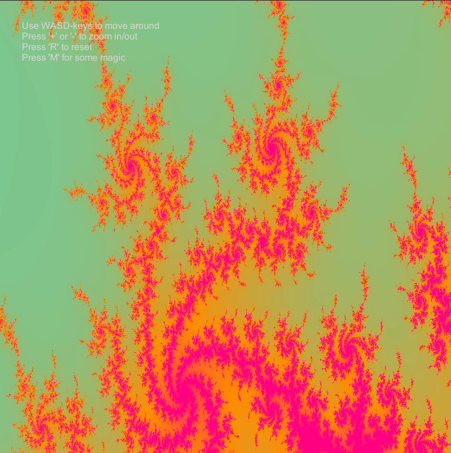

# CGCV Unity lab assignment submissions

[Link to GitHub main repository](https://github.com/steffenricklin/cgcv-lab-assignments)

[Back to the lab overview](https://steffenricklin.github.io/cgcv-lab-assignments/)

[This page as GitHub pages](https://steffenricklin.github.io/cgcv-lab-assignments/lab6/)

## Lab 6

The task was to create a Mandelbrot shader.

The code of our **main submission** can be inspected following the link below.
This includes the c# and shader scripts of exercise 1 and exercise 2 of which the latter scripts are named _Mandelbrot.cs_ and _Mandelbrot.compute_.
That directory also contains the screenshots shown below as well as a **Windows Build** to run it.

[Link to main submission.](https://github.com/steffenricklin/cgcv-lab-assignments/lab6/MainSubmission/)

As a **bonus** we also created a Mandelbrot Shader without using the computeShader. That bonus can be found following the link below.
The directy of the bonus also includes the c# and shader scripts, screenshots as well as a **MacOS Build**.

[Link to the bonus implementation.](https://github.com/steffenricklin/cgcv-lab-assignments/blob/main/lab6/RonScripts)

We have a third implementation that uses the mouse to zoom in and out whereas the main submission uses the WASD-keys to move and the + and - keys to zoom.
In ComputeShader you can find both a MacOS build and the corresponding c# and shader script.

[Link to the third (optional) implementation.](https://github.com/steffenricklin/cgcv-lab-assignments/tree/main/lab6/ComputeShader)

### Gif of the bonus implementation

___

### Screenshots of the main submission

Despite the screenshots saying "_Press 'M' for some magic_", the magic only happens if _'Space'_ is pressed. The UI label is fixed in the uploaded build.

___

### Screenshots of the third implementation

___

___

[Link to GitHub repository](https://github.com/steffenricklin/cgcv-lab-assignments)

[Back to the lab overview](https://steffenricklin.github.io/cgcv-lab-assignments/)

___
